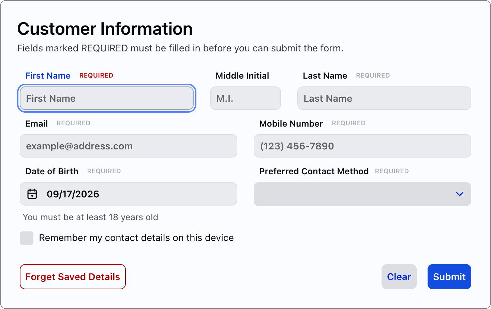

# DWC Customer Input Form

## Introduction

Nearly every business application needs a data-entry form, and most BBj developers have written dozens of them. But when that form runs in a browser, customers expect a lot more than a grid of edit boxes. They expect labels that stay put, a clear indication of which fields are required, instant feedback when they mistype an email address, a date picker, their browser offering to fill in their name, and a layout that looks just as good on their phone as it does on their desktop.

So how much code does all of that take? A lot less than you might think. The DWC (Dynamic Web Client) supports a number of control attributes, methods, and events that do the heavy lifting for you, but many of them are not widely known. This demo exists to put them all in one place. It builds a small but fully functional customer information form, and every feature in it comes from a BBj method or attribute that you can use in your own applications.

The attributes used throughout the demo come from the [DWC documentation](https://dwc.style/docs/#/dwc/), which lists every attribute, CSS part, and design token that each DWC control supports. It is well worth bookmarking, because it is where you will find the next attribute you did not know existed.

The same form is written two ways, so you can read whichever style matches your own code:

- **CustomerFormOOP.bbj** uses BBj custom classes: a `CustomerForm` class for the form and a `FormUtils` class for the cookie, validation, and CSS helpers.
- **CustomerFormProcedural.bbj** uses traditional procedural BBj, with labels, `GOSUB`, and `DEF FN` functions.

Both files behave identically, and each one is completely self-contained, including its CSS.



*Figure 1. The customer information form, with focus on the First Name field*

## Running the Demo

The form runs in the DWC only. To try it out:

1. In Enterprise Manager, register a new application with the program set to either `CustomerFormOOP.bbj` or `CustomerFormProcedural.bbj`, and the working directory set to this folder.
2. Make sure the application has the DWC enabled.
3. Open the application in a browser at `http://<server>:8888/webapp/<AppName>`.

There are no other files, libraries, or configuration settings to set up.

## Features

### Labels that belong to their input

The most visible feature is also the simplest. Rather than creating a separate `BBjStaticText` control and positioning it above each input, the demo sets the input's `label` attribute:

```bbj
firstNameInput!.setAttribute("label", "First Name")
```

That one line is better in three ways. First, there are fewer controls to create and manage. Second, BBj lays out and positions the label along with its input, so the two can never drift apart when the layout changes size. And third, the label is tied to its input, so screen readers announce it when the field receives focus.

Every input also sets a `placeholder` attribute for the hint text shown inside an empty field, and a tooltip with `setToolTipText()`. The Date of Birth field adds a `helper-text` attribute, which displays a permanent note underneath the input.

### Required fields, clearly marked

Each mandatory field sets the `required` attribute to `true`. The demo then uses a bit of CSS to display the word REQUIRED after the label of every required field. It is shown in gray by default, turns red while the field has focus, and turns bold red while the mouse is over the field.

It is worth pointing out how that CSS reaches the label. DWC controls are web components, which means their inner elements are hidden inside a shadow DOM where your normal CSS selectors cannot reach them. The DWC exposes certain inner elements as named parts, though, and the `::part(label)` selector lets us style the label directly:

```css
dwc-field[required]::part(label)::after {
  content: 'REQUIRED';
  ...
}
```

Because the selector keys off the `required` attribute, marking a new field as required automatically marks its label as well. There is no second place to keep in sync.

### Validation that runs in the browser

Waiting for a round trip to the server just to tell a customer that they forgot the @ sign in their email address is not a great experience. Instead, each field supplies a JavaScript expression with `setClientValidationFunction()`, and the browser evaluates it as the customer types:

```bbj
emailInput!.setClientValidationFunction("/^[A-Za-z0-9._%+-]+@[A-Za-z0-9.-]+\.[A-Za-z]{2,}$/.test(value.trim())")
emailInput!.setAttribute("invalid-message", "Enter a valid email address")
```

When the expression returns false, the field is flagged as invalid and shows the text from its `invalid-message` attribute. A few details are worth noting:

- **Expressions and function bodies.** A simple rule can be a single expression. The Date of Birth rule needs several statements to calculate the 18-year cutoff date, so it uses `return`, which tells the DWC to treat it as a function body instead.
- **Optional fields.** The Middle Initial rule accepts a blank value or a single letter, so the field is validated without being required. Its `maxlength` attribute also stops the customer from typing more than one character.
- **Waiting until Submit.** Nobody enjoys being told that their email address is invalid when they have only typed the first three letters. The Email, Mobile Number, and Date of Birth fields set the `auto-validate` attribute to `false`, which holds off on validating those fields until the customer clicks the Submit button.

### Input masks and a calendar picker

The Mobile Number field is a `BBjInputE` with the mask `(000) 000-0000`, so the parentheses, space, and dash appear automatically and the customer only types digits. The Date of Birth field is a `BBjInputD` with the mask `%Mz/%Dz/%Yl`. Its `calendar-icon-visible` attribute adds a calendar button for picking a date, and its `insert-mode` attribute lets the customer type the date straight through without overwriting the slashes.

### Browser autofill

Browsers can offer to fill in a customer's name, email address, phone number, and birthday from the details they have saved, but only if they know what each field is for. The `autocomplete` attribute tells them:

```bbj
firstNameInput!.setAttribute("autocomplete", "given-name")
```

The demo uses the standard values `given-name`, `additional-name`, `family-name`, `email`, `tel-national`, and `bday`. The customer ends up with a form that fills itself in after one or two clicks, and it costs us just one line of code per field.

### Remembering the customer with cookies

When the customer checks **Remember my contact details on this device** and submits the form, their name, email address, phone number, and preferred contact method are saved in browser cookies. The next time they open the form, those fields are already filled in.

BBj handles cookies through the `BBjThinClient` object:

```bbj
thinClient!.setUserProperty(BBjThinClient.USER_PROPERTIES_COOKIES, name$, value$)
value$ = thinClient!.getUserProperty(BBjThinClient.USER_PROPERTIES_COOKIES, name$)
```

There are a few things to keep in mind when working with cookies, and the demo handles each of them:

- In the DWC, cookies expire after 30 days.
- `getUserProperty()` throws `!ERROR=11` when a cookie does not exist, so the demo reads cookies with `err=*NEXT`.
- Values are URL-encoded before they are saved, so characters such as spaces, commas, and semicolons survive the trip.
- Every cookie name starts with a `dwcCustomerForm_` prefix, so the form cannot collide with another application's cookies.
- A cookie is deleted by setting its value to `null()`. Setting an already-expired cookie also removes it, but the browser then cannot read the cookie back to confirm the write, and BBj reports `!ERROR=17`.

The **Forget Saved Details** button deletes the cookies but leaves the fields on the form alone. The **Clear** button does the opposite: it empties every field but leaves the saved cookies in place.

### Submitting with ON_FORM_VALIDATION

This is where it all comes together. Rather than the usual `ON_BUTTON_PUSH` event, the Submit button registers for `ON_FORM_VALIDATION`:

```bbj
submitButton!.setCallback(BBjButton.ON_FORM_VALIDATION, #this!, "onSubmit")
```

That one change buys us two things. First, the browser runs every client-side validation rule before anything is sent to the server, and the callback only fires once every field is valid. Second, the `BBjFormValidationEvent` carries the value of every control on the form, so the program reads them with `getText()`, `getValue()`, `getSelectedIndex()`, and `isSelected()` on the event, without making a separate round trip to the browser for each control.

But if the browser has already validated everything, why does the callback check the values again? Because browser checks can be bypassed by anyone with the developer tools open. The demo repeats every rule on the server, using Java's `Pattern` class for the email and phone number formats and a julian date calculation for the minimum age, which even handles the case where the form is submitted on February 29.

Keep in mind that every `ON_FORM_VALIDATION` callback must call `accept()`. When the demo finds a problem, it calls `accept(0)` to reject the submission and unlock the window so the customer can make corrections. When everything checks out, it calls `accept(1)`. Forget to call either one, and the window stays locked.

### HTML message boxes with themes

The demo reports its results with `MSGBOX`, and there are two lesser-known tricks involved. First, a message that starts with `<html>` is rendered as HTML, so the validation errors appear as a bulleted list and the submitted values appear in a table. Second, the `mode="theme=..."` option colors the dialog to match its purpose: `warning` for validation errors, `success` for a completed submission, and `info` for the confirmation that the saved details were removed.

Because the customer's own text ends up inside that HTML, the demo escapes the `<`, `>`, and `&` characters before displaying it, so a last name such as `<b>Smith</b>` is shown exactly as typed. Note that BBj reads a single `&` specially in control and message text, so each entity is written with a doubled ampersand, such as `&&lt;`.

### A responsive layout for desktops, tablets, and phones

The form runs equally well on a desktop, tablet, or phone, and there is not a single x or y coordinate in the code. The top-level window is created with the Automatic Layout flag (`$00100000$`), which hands positioning over to CSS. From there:

- The form card uses a CSS grid with two columns, and the name row uses its own three-column grid so the middle initial gets a narrow `7rem` column.
- A `full-width` class spans a control across every column of the grid.
- The button row uses flexbox with wrapping, and `margin-right: auto` on the Forget Saved Details button pushes it to the far left while Clear and Submit stay on the right.
- A media query switches both grids to a single column when the screen is 600 pixels wide or narrower, so the fields stack neatly on a phone.

The CSS is added to the page with `BBjWebManager.injectStyle()`, and it uses the DWC's own design tokens, such as `--dwc-space-m` and `--dwc-surface-3`, rather than hard-coded values. It also adds padding around each input and button, so the keyboard focus ring is not clipped by neighboring controls.

### Light and dark themes

The program calls `setTheme("system")` on the `BBjWebManager`, so the form automatically follows the customer's operating system setting and switches between light and dark mode. Because the CSS is built from DWC design tokens, the form card, shadows, and colors adapt along with it.

### A clean exit

The program ends when the customer closes the window (`ON_CLOSE`) or the browser tab (`BBjWebManager.ON_BROWSER_CLOSE`), and after they dismiss the summary of a successful submission. It also calls `releaseOnLostConnection(0)` with a `SETESC` handler, so a dropped connection is logged to the BBjServices debug log rather than leaving an interpreter running on the server.

## Attributes and Methods at a Glance

The table below summarizes everything the demo uses. For the complete list of attributes, parts, and tokens available on each control, see the [DWC documentation](https://dwc.style/docs/#/dwc/).

| Attribute or method | What it does in the demo |
| --- | --- |
| `label` | Displays a label that is positioned with its input and read by screen readers |
| `placeholder` | Shows hint text inside an empty field |
| `helper-text` | Shows a permanent note underneath the field |
| `setToolTipText()` | Shows a tooltip when the mouse is over the control |
| `required` | Marks the field as mandatory, and drives the REQUIRED label marker |
| `setClientValidationFunction()` | Validates the field in the browser with a JavaScript expression |
| `invalid-message` | Sets the message shown when the field fails validation |
| `auto-validate` | Set to `false` to wait until Submit before validating |
| `maxlength` | Limits how many characters can be typed |
| `setMask()` | Formats phone numbers and dates as they are typed |
| `calendar-icon-visible` | Adds a calendar picker to a `BBjInputD` |
| `insert-mode` | Lets the customer type a date straight through |
| `autocomplete` | Tells the browser which saved value to offer |
| `theme` | Styles buttons (`primary`, `outlined-danger`) |
| `ON_FORM_VALIDATION` | Validates the whole form, then delivers every value in one event |
| `BBjThinClient.setUserProperty()` | Saves and deletes browser cookies |
| `MSGBOX` with `<html>` and `mode="theme=..."` | Displays formatted, color-coded dialogs |
| `BBjWebManager.injectStyle()` | Adds the form's CSS to the page |
| `BBjWebManager.setTheme("system")` | Follows the operating system's light or dark mode |
| Automatic Layout (`$00100000$`) | Lets CSS position every control |

## Files

| File | Description |
| --- | --- |
| `CustomerFormOOP.bbj` | The form written with BBj custom classes |
| `CustomerFormProcedural.bbj` | The same form written in procedural BBj |
| `CustomerFormScreenshot.png` | The screenshot shown in Figure 1 |

## Summary

A form that validates as the customer types, marks its required fields, formats phone numbers and dates, fills itself in from the browser and from cookies, double-checks everything on the server, and adapts to any screen size sounds like a big project. But as this demo shows, nearly all of that functionality is already built into the DWC and just waiting to be switched on with an attribute or a method call. So the next time you build a data-entry form, why not let BBj and the browser do the grunt work for you?
